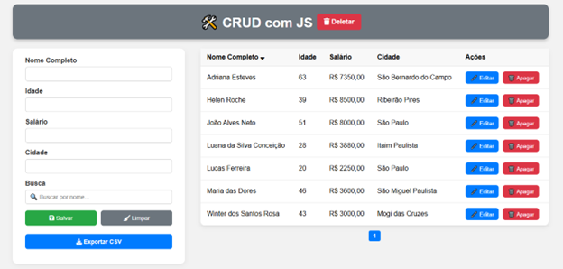

# 🛠️ CRUD com JavaScript

Eu criei este projeto completo de CRUD (Create, Read, Update, Delete) feito com HTML, CSS e JavaScript puro. Ideal para iniciantes que desejam entender a manipulação de DOM, armazenamento local, e funcionalidades interativas modernas.

## 🚀 Funcionalidades

- ✅ Inserção de dados: nome, idade, salário e cidade
- ✅ Edição e exclusão de dados
- ✅ Validação de formulário
- ✅ Confirmação ao salvar e deletar
- ✅ Armazenamento com **LocalStorage**
- ✅ Exportação para **CSV**
- ✅ Busca dinâmica por nome
- ✅ **Paginação automática** dos registros
- ✅ Salário formatado com `R$` e casas decimais
- ✅ Ordenar a coluna nome por ordem alfabética
- ✅ Responsivo para desktop e mobile

---

## 🖼️ Interface



---

## 📦 Tecnologias utilizadas

- HTML5
- CSS3
- JavaScript (ES6)
- [Font Awesome](https://fontawesome.com/) para ícones

---

## 📝 Como usar

1. **Clone o repositório**

```bash
git clone https://github.com/wintersro/Crud-com-Js.git
cd crud-js
```

2. **Abra o arquivo HTML**

Você pode abrir o arquivo `index.html` diretamente no navegador ou utilizar um servidor local.

---

## 📁 Estrutura do Projeto

```
crud-js/
├── index.html           # Estrutura principal da interface
├── main.css             # Estilos customizados e tema escuro
├── main.js              # Lógica de CRUD, tema, exportação, etc.
└── crud.png             # Imagem da interface 
```

---

## 📌 Detalhes Técnicos

### 🔄 LocalStorage

Todos os dados são salvos localmente no navegador. Isso significa que ao atualizar a página, os dados inseridos continuam lá.

### 🔎 Busca

O campo de busca filtra os nomes em tempo real.

### 📄 Exportação CSV

Clique no botão **Exportar CSV** para gerar um arquivo com os dados salvos.

### 📃 Paginação

Se houver muitos registros, eles são divididos automaticamente em páginas para melhor organização visual.

---

## 💡 Melhorias Futuras

- ✅ Armazenar preferência de tema no `localStorage`
- ⏳ Adicionar suporte a banco de dados (Firebase, Supabase etc.)
- ⏳ Integração com backend via API
- ⏳ Tema claro / escuro
- ⏳ Upload de foto do empregado

---

## 👨‍💻 Autor

Desenvolvido por [Seu Nome](https://github.com/wintersro)  
📧 wintersantosrosa@gmail.com

---

## 📄 Licença

Este projeto está sob a licença MIT. Sinta-se à vontade para usar e modificar!